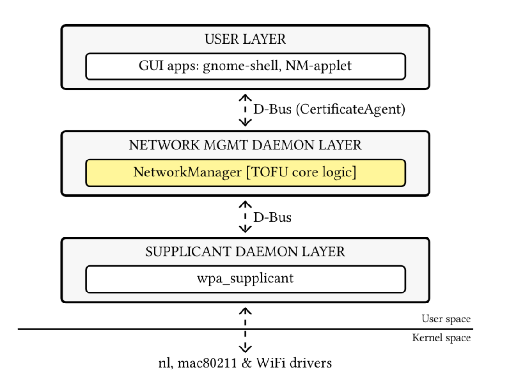
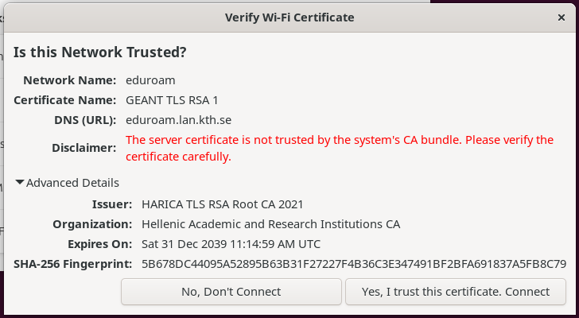

# NetworkManager: Secure Trust On First Use (TOFU)


This repository contains a prototype implementation of **Trust on First Use (TOFU)** for 802.1X Enterprise Wi-Fi networks in [NetworkManager](https://gitlab.freedesktop.org/NetworkManager/NetworkManager.git). 

**Read the full research paper:**  
*[Secure Trust On First Use for Enterprise Wi-Fi](https://papers.mathyvanhoef.com/wisec2026.pdf)*  
**Authors:** Rathan Appana & Mathy Vanhoef (Presented at ACM WiSec 2026)

## How it works
TOFU framework implemented on NetworkManager.


When a user connects to a WPA-Enterprise (802.1X) network without a pre-configured CA certificate:
1. **wpa_supplicant** initiates the TLS handshake and detects an untrusted certificate.
2. **NetworkManager** intercepts this event instead of outright failing/continuing  the connection.
3. NetworkManager extracts the certificate details (hash, issuer, subject) and pauses the authentication.
4. Using the **D-Bus API**, NetworkManager queries the active GUI agent (e.g., `nm-applet` or GNOME Shell).
5. The user is presented with a clear security prompt to verify the certificate fingerprint.



If the user accepts, NetworkManager securely pins the certificate hash to the connection profile, protecting against future Evil Twin attacks.

## Build and Installation Guide

This project is built for Debian-based systems (tested on Ubuntu 24.04 and 26.04), but apply similarly to other linux based distributions with some modifications.

> <span style="color:red">**Prerequisite:** You must have source repositories (`deb-src`) enabled in your APT configuration (e.g., `/etc/apt/sources.list.d/ubuntu.sources`) to fetch NetworkManager's build dependencies.</span>

### Option A: Quick Install (Recommended for Researchers/Testing)
For artifact evaluation or quick setup, use the provided installation script. It will automatically install dependencies, compile the code, and restart the NetworkManager daemon.

```bash
git clone [https://github.com/rathanappana/NetworkManager-TOFU.git](https://github.com/rathanappana/NetworkManager-TOFU.git)
cd NetworkManager-TOFU
git checkout tofu

# Give necessary permissions to installation script
sudo chmod +x install_tofu.sh

# Run the automated build and install script
./install_tofu.sh
```

### Option B: Manual build (for developers)
If you prefer to compile manually or are actively modifying the code:

1. Install dependencies
```bash
sudo apt update
sudo apt install meson ninja-build build-essential cmake libdbus-1-dev libbpf-dev libsystemd-dev libnss3-dev
sudo apt build-dep network-manager
```
2. Configure and compile
(Note: CLAT and NBFT are disabled to simplify dependencies on standard ubuntu builds)
```bash
git clone [https://github.com/rathanappana/NetworkManager-TOFU.git](https://github.com/rathanappana/NetworkManager-TOFU.git)
cd NetworkManager-TOFU
git checkout tofu
meson setup build --prefix=/usr --sysconfdir=/etc --localstatedir=/var -Dclat=false -Dnbft=false
ninja -C build
```
3. Install and apply changes
```bash
sudo ninja -C build install
sudo systemctl daemon-reload
sudo systemctl restart NetworkManager
```

## Debugging and logs
To monitor how the TOFU flow is executing in real-time, view the NetworkManager logs:
```bash
sudo journalctl -u NetworkManager -f
```
Enable Advanced Debugging:
If you need deeper insights into the Wi-Fi or 802.1X domains:
```bash
# View available logging domains
nmcli general logging 
# Enable DEBUG logging for ALL domains 
sudo nmcli general logging level DEBUG domains ALL
```

## User Interfaces

NetworkManager operates as a headless daemon. To configure the TOFU flag and interact with the certificate trust prompts, you must use a compatible front-end. We provide support for both terminal and graphical environments.

### TUI Integration `nmtui`

This repository includes modifications to NetworkManager's native text user interface, `nmtui`. Because it is built directly from this source tree, it is available immediately after installation without needing external repositories.

See [how to trigger TOFU](#how-to-trigger-and-test-tofu)

1. Configuration: Open `nmtui` in your terminal, edit a WPA-Enterprise Wi-Fi connection, and check the newly added option to enable TOFU support.

2. Prompting: When connecting to a network with an unknown certificate, nmtui presents a terminal-based pop-up displaying the certificate fingerprint, allowing you to accept or reject the connection.

### GUI Integration

For a standard desktop experience, we have modified the `nm-applet` GUI agent. Because graphical applets are maintained outside the core NetworkManager source tree, you must compile and run the modified applet separately to see native desktop TOFU dialogs.

* **Modified NM-Applet (GUI):** [rathanappana/network-manager-applet-tofu](https://github.com/rathanappana/network-manager-applet-tofu)

Make sure to run the modified `nm-applet` from the repository above to handle the TOFU D-Bus requests. (Support for GNOME Shell's native Wi-Fi dialogs is planned/in progress).

## How to trigger and test TOFU

By default, TOFU is not globally enabled to maintain backward compatability with standard NetworkManager behaviour. you must explictly enable it for a specific 802.1X connection.

### Option 1: Testing on a Real Enterprise Network
If your are physically near an Enterprise networks such as Eduroam networks with a wifi chipset (From a Virtual machine you need a usb wifi though and to enable it via settings in virtual box or follow option 2)

1. Create or modify the Wi-Fi connection profile.
2. Enable the TOFU flag using `nmcli`:
```bash
# Replace 'My_Enterprise_WiFi' with your actual connection name
nmcli connection modify My_Enterprise_WiFi 802-1x.tofu yes
```
3. Attempt to connect. Because you haven't pinned a CA certificate, the NM itself pauses the connection whenever CA is not pinned and TOFU is enabled. and running `nm-applet` will prompt you to trust unknown certificate.

### Option 2: Automated local simulation using `mac80211_hwsim`

If you don't have access to a real Enterprise network, you can simulate one entirely in software using Linux's `mac80211_hwsim` kernel module. This creates virtual Wi-Fi interfaces that act like real hardware.

We provide a script that automatically spins up a virtual Access Point with a self-signed certificate to trigger the TOFU flow locally.


> <span style="color:green">comming soon </span>


## Repository workflow (for contributors)
To keep this implementation "upstream-friendly", we maintain a specific git workflow separating upstream tracking from our TOFU features.

1. `main` branch: Mirrors the upstream NetworkManager repository.
2. `tofu` branch: Contains the TOFU implementation, actively rebased on top of `main`.

To update the code with the latest upstream changes:
```bash
git add remote upstream https://gitlab.freedesktop.org/NetworkManager/NetworkManager.git 
# 1. Fetch upstream changes
git fetch upstream

# 2. Update the main branch
git checkout main
git pull upstream main

# 3. Rebase the TOFU branch
git checkout tofu
git rebase main

# (Resolve conflicts if any occur, then run: git rebase --continue)

# 4. Push updated TOFU branch to your fork
git push origin tofu --force
```

## Authors & Citation

This feature was developed by Rathan Appana as part of research conducted with Mathy Vanhoef.

If you use this code in your research, please cite our WiSec 2026 paper:
Code snippet.
```tex
@inproceedings{appana2026tofu,
  title={Secure Trust On First Use for Enterprise Wi-Fi},
  author={Appana, Rathan and Vanhoef, Mathy},
  booktitle={Proceedings of the 19th ACM Conference on Security and Privacy in Wireless and Mobile Networks (WiSec '26)},
  year={2026}
}
```